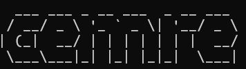

# Cemre Data Distribution System

This is a simple data distribution system for testing file transfer between two folders.

## Features

- Ensures two folders (`folder1` and `folder2`) exist in your project directory.
- Removes any existing file named `HELLOOOOO` from both folders on startup.
- Waits for user input in the terminal.
- On typing `transfer`, creates a file named `HELLOOOOO` in `folder1` and copies it to `folder2`.

## Usage

1. **Install dependencies**  
   Run in your project directory:
   ```sh
   npm install
   ```

2. **Compile the TypeScript code**  
   ```sh
   npx tsc
   ```

3. **Run the program**  
   ```sh
   node dist/main.js
   ```

4. **Follow the prompt**  
   - Type `transfer` and press Enter to create and move the file.

## Project Structure

```
Cemre/
├── assets/
│   └── cemre-logo.png
├── folder1/
├── folder2/
├── src/
│   └── main.ts
├── dist/
│   └── main.js
├── package.json
├── tsconfig.json
└── README.md
```

## Notes

- The folders and files are created in the directory where you run the program.
- You can modify the file and folder names in `src/main.ts` as needed.
